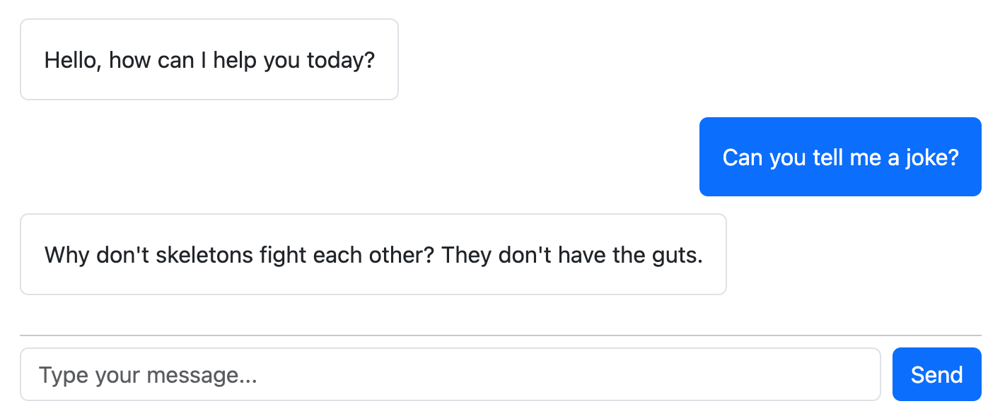
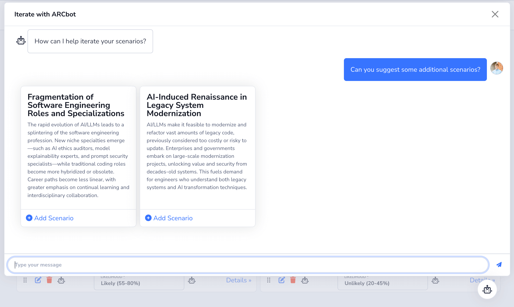



# Conversations Overview {#overview}

Raif provides full-stack (models, views, & controllers) LLM chat interface with built-in [streaming support](#real-time-streaming-responses). 

If you use the `raif_conversation` view helper, it will automatically set up a chat interface that looks something like:

{:class="img-border"}

This feature utilizes Turbo Streams, Stimulus controllers, and ActiveJob, so your application must have those set up first. 

# Setup
First set up the css and javascript in your application. In the `<head>` section of your layout file:
```erb
<%= stylesheet_link_tag "raif" %>
```

In an app using import maps, add the following to your `application.js` file:
```js
import "raif"
```

In your initializer, configure who can access the conversation controllers (you'll need to restart your server for this to take effect):
```ruby
Raif.configure do |config|
  config.authorize_controller_action = ->{ current_user.present? }
end
```

In a controller serving the conversation view:
```ruby
class ExampleConversationController < ApplicationController
  def show
    @conversation = Raif::Conversation.where(creator: current_user).order(created_at: :desc).first

    if @conversation.nil?
      @conversation = Raif::Conversation.new(creator: current_user)
      @conversation.save!
    end
  end
end
```

And then in the view where you'd like to display the conversation interface:
```erb
<%= raif_conversation(@conversation) %>
```

By default, the conversation interface will use Bootstrap styles. If your app does not include Bootstrap, you can [override the views](../learn_more/customization#views) to update styles.

# Conversation Types

You can create a custom conversation types using the generator, which gives you more control over the conversation's system prompt, initial greeting message, and available [model tools](#using-model-tools).

For example, say you are implementing a customer support chatbot in your application and want to a specialized system prompt and initial message for that conversation type:

```bash
rails generate raif:conversation CustomerSupport
```

This will create a new conversation type in `app/models/raif/conversations/customer_support.rb`.

You can then customize the system prompt, initial message, and available [model tools](model_tools) for that conversation type:

```ruby
class Raif::Conversations::CustomerSupport < Raif::Conversation
  def system_prompt_intro
    <<~PROMPT
      You are a helpful assistant who specializes in customer support. You're working with a customer who is experiencing an issue with your product.
    PROMPT
  end
  
  # The initial message is used to greet the user when the conversation is created.
  def initial_chat_message
    I18n.t("#{self.class.name.underscore.gsub("/", ".")}.initial_chat_message")
  end
end
```

# Conversation Entries

Each time the user submits a message, a `Raif::ConversationEntry` record is created to store the user's message & the LLM's response. By default, Raif will:
1. Queue a `Raif::ConversationEntryJob` to process the entry
2. Make the API call to the LLM
3. Call `Raif::Conversation#process_model_response_message` on the associated conversation to [pre-process the response](#pre-processing-conversation-entry-responses).
4. Invoke any tools called by the LLM & create corresponding `Raif::ModelToolInvocation` records
5. Broadcast the completed conversation entry via Turbo Streams

# Using Model Tools

You can make [model tools](../key_raif_concepts/model_tools) available to the LLM in your conversations by including them in the `Raif::Conversation#available_model_tools` array.

Here's an example that adds tools to our `CustomerSupport` conversation:

```ruby
class Raif::Conversations::CustomerSupport < Raif::Conversation
  before_create ->{
    self.available_model_tools = [
      "Raif::ModelTools::SearchKnowledgeBase",
      "Raif::ModelTools::FileSupportTicket" 
    ]
  }

  def system_prompt_intro
    <<~PROMPT
      You are a helpful assistant who specializes in customer support. You're working with a customer who is experiencing an issue with your product.
    PROMPT
  end
end
```

## Displaying Model Tool Invocations in a Conversation

When you generate a new model tool, Raif will automatically create a corresponding view partial for you in `app/views/raif/model_tool_invocations`. The conversation interface will then use that partial to render the `Raif::ModelToolInvocation` record that is created when the LLM invokes your tool.

Here is an example of the LLM invoking a `SuggestNewScenarios` tool in a conversation:

{:class="img-border"}

If your tool should not be displayed to the user, you can override the `renderable?` method in your model tool class to return false:

```ruby
class Raif::ModelTools::SuggestNewScenarios < Raif::ModelTool
  def renderable?
    false
  end
end
```

## Providing Tool Observations/Results to the LLM

Once the tool invocation is completed (via the tool's [`process_invocation` method](../key_raif_concepts/model_tools#processing-model-tool-inovcations)), the result needs to be provided back to the LLM. For example, if you're implementing a `GoogleSearch` tool, you'll want to return the search results. Raif calls this an observation.

You implement the `observation_for_invocation` method in your model tool class to control what is provided back to the LLM:

```ruby
class Raif::ModelTools::GoogleSearch < Raif::ModelTool
  class << self
    def observation_for_invocation(tool_invocation)
      JSON.pretty_generate(tool_invocation.result)
    end
  end
end
```

# Pre-processing Conversation Entry Responses

You may want to manipulate the LLM's response before it's displayed to the user. For example, say your system prompt instructs the LLM to include citations in its response, formatted like `[DocumentID 123]`. You then want to replace those citations with links to the relevant documents.

You can do this by overriding the `process_model_response_message` method in your conversation class:

```ruby
class Raif::Conversations::CustomerSupport < Raif::Conversation
  def process_model_response_message(message)
    message.gsub!(/\[DocumentID (\d+)\]/i, '<a href="/documents/\1">\1</a>')
  end
end
```

This method is called after the LLM's response is received and before it's displayed to the user.

# Real-time Streaming Responses

Raif conversations include built-in support for streaming responses, where the LLM's response is displayed progressively as it's being generated.

Each time a conversation entry is updated during the streaming response, Raif will call `broadcast_replace_to(conversation)` (where `conversation` is the `Raif::Conversation` associated with the conversation entry). When using the `raif_conversation` view helper, it will automatically set up the Turbo Streams subscription for you.

## Streaming Chunk Size Configuration

By default, Raif will update the conversation entry's associated `Raif::ModelCompletion` and call `broadcast_replace_to(conversation)` after 25 characters have been accumulated from the streaming response. If you want this to happen more or less frequently,
you can change the `streaming_chunk_size` configuration option in your initializer:

```ruby
Raif.configure do |config|
  config.streaming_chunk_size = 100
end
```
