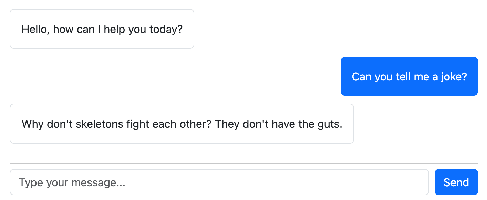
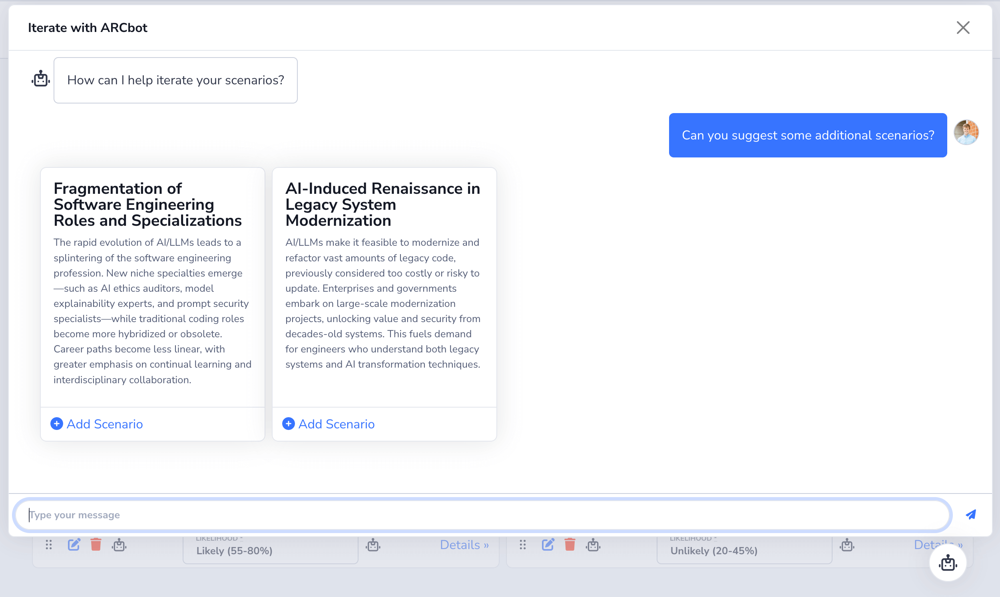



# Conversations Overview {#overview}

Raif provides a full-stack (models, views, & controllers) LLM chat interface with built-in [streaming support](#real-time-streaming-responses). 

If you use the `raif_conversation` view helper, it will automatically set up a chat interface that looks something like:

{:class="img-border"}

This feature utilizes Turbo Streams, Stimulus controllers, and ActiveJob, so your application must have those set up first. 

# Setup
First set up the css and javascript in your application. In the `<head>` section of your layout file:
```erb
<%= stylesheet_link_tag "raif" %>
```

In an app using import maps, add the following to your `application.js` file:
```js
import "raif"
```

In your initializer, configure who can access the conversation controllers (you'll need to restart your server for this to take effect):
```ruby
Raif.configure do |config|
  config.authorize_controller_action = ->{ current_user.present? }
end
```

In a controller serving the conversation view:
```ruby
class ExampleConversationController < ApplicationController
  def show
    @conversation = Raif::Conversation.where(creator: current_user).order(created_at: :desc).first

    if @conversation.nil?
      @conversation = Raif::Conversation.new(creator: current_user)
      @conversation.save!
    end
  end
end
```

And then in the view where you'd like to display the conversation interface:
```erb
<%= raif_conversation(@conversation) %>
```

By default, the conversation interface will use Bootstrap styles. If your app does not include Bootstrap, you can [override the views](../learn_more/customization#customizing-views) to update styles.

# Conversation Types

You can create custom conversation types using the generator, which gives you more control over the conversation's system prompt, initial greeting message, and available [model tools](#using-model-tools).

For example, say you are implementing a customer support chatbot in your application and want to a specialized system prompt and initial message for that conversation type:

```bash
rails generate raif:conversation CustomerSupport
```

This will create a new conversation type in `app/models/raif/conversations/customer_support.rb` along with a system prompt [template](../learn_more/prompt_templates) at `app/views/raif/conversations/customer_support.system_prompt.erb`.

You can define the system prompt either in the template or by overriding methods in the class. You can also customize the initial message and available [model tools](model_tools):

```ruby
class Raif::Conversations::CustomerSupport < Raif::Conversation
  before_create ->{
    self.available_model_tools = [
      "Raif::ModelTools::SearchKnowledgeBase",
      "Raif::ModelTools::FileSupportTicket" 
    ]
  }

  before_prompt_model_for_entry_response do |entry|
    # Any processing you want to do just before the model is prompted for a response to an entry
  end

  def system_prompt_intro
    <<~PROMPT
      You are a helpful assistant who specializes in customer support. You're working with a customer who is experiencing an issue with your product.
    PROMPT
  end
  
  # The initial message is used to greet the user when the conversation is created.
  def initial_chat_message
    I18n.t("#{self.class.name.underscore.gsub("/", ".")}.initial_chat_message")
  end
end
```

You'll also need to add the conversation type to your initializer:

```ruby
Raif.configure do |config|
  config.conversation_types += [
    "Raif::Conversations::CustomerSupport"
  ]
end
```

# Conversation Entries

Each time the user submits a message, a `Raif::ConversationEntry` record is created to store the user's message & the LLM's response. By default, Raif will:
1. Queue a `Raif::ConversationEntryJob` to process the entry
2. Make the API call to the LLM
3. Call `Raif::Conversation#process_model_response_message` on the associated conversation to [pre-process the response](#pre-processing-conversation-entry-responses)
4. Validate any tool calls the LLM produced. If any are malformed (unknown tool name, missing/invalid arguments), Raif will re-prompt the model with corrective feedback up to `Raif.config.conversation_entry_max_retries` times (default: 2) before marking the entry as failed. See [Tool-Call Repair Loop](#tool-call-repair-loop) below
5. Invoke any tools called by the LLM & create corresponding `Raif::ModelToolInvocation` records
6. Call `Raif::Conversation#on_entry_finalized` to run any [post-finalization side effects](#post-finalization-side-effects)
7. Broadcast the completed conversation entry via Turbo Streams

# Using Model Tools

You can make [model tools](../key_raif_concepts/model_tools) available to the LLM in your conversations by including them in the `Raif::Conversation#available_model_tools` array.

Here's an example that provides `Raif::ModelTools::SearchKnowledgeBase` and `Raif::ModelTools::FileSupportTicket` tools to the LLM in our `CustomerSupport` conversation:

```ruby
class Raif::Conversations::CustomerSupport < Raif::Conversation
  before_create ->{
    self.available_model_tools = [
      "Raif::ModelTools::SearchKnowledgeBase",
      "Raif::ModelTools::FileSupportTicket" 
    ]
  }

  def system_prompt_intro
    <<~PROMPT
      You are a helpful assistant who specializes in customer support. You're working with a customer who is experiencing an issue with your product.
    PROMPT
  end
end
```

## Displaying Model Tool Invocations in a Conversation

When you generate a new model tool, Raif will automatically create a corresponding view partial for you in `app/views/raif/model_tool_invocations`. The conversation interface will then use that partial to render the `Raif::ModelToolInvocation` record that is created when the LLM invokes your tool.

Here is an example of the LLM invoking a `SuggestNewScenarios` tool in a conversation and displaying it using its `app/views/raif/model_tool_invocations/_suggest_new_scenarios.html.erb` partial:

{:class="img-border"}

If your tool should not be displayed to the user, you can override the `renderable?` method in your model tool class to return false:

```ruby
class Raif::ModelTools::SuggestNewScenarios < Raif::ModelTool
  def renderable?
    false
  end
end
```

## Providing Tool Observations/Results to the LLM

Once the tool invocation is completed (via the tool's [`process_invocation` method](../key_raif_concepts/model_tools#processing-model-tool-invocations)), you can provide the result back to the LLM as an observation. For example, if you're implementing a `GoogleSearch` tool, you'll want to return the search results.

If your tool returns `true` from `triggers_observation_to_model?`, Raif will use `observation_for_invocation` when building the next conversation turn for the LLM. The raw `tool_invocation.result` is still persisted for admin pages and custom UI rendering.

You implement the `observation_for_invocation` method in your model tool class to control what is provided back to the LLM:

```ruby
class Raif::ModelTools::GoogleSearch < Raif::ModelTool
  class << self
    def observation_for_invocation(tool_invocation)
      JSON.pretty_generate(tool_invocation.result)
    end
  end
end
```

# Pre-processing Conversation Entry Responses

You may want to manipulate the LLM's response before it's displayed to the user. For example, say your system prompt instructs the LLM to include citations in its response, formatted like `[DocumentID 123]`. You then want to replace those citations with links to the relevant documents.

You can do this by overriding the `process_model_response_message` method in your conversation class:

```ruby
class Raif::Conversations::CustomerSupport < Raif::Conversation
  def process_model_response_message(message:, entry:)
    message.gsub(/\[DocumentID (\d+)\]/i, '<a href="/documents/\1">\1</a>')
  end
end
```

{: .warning }
`process_model_response_message` is invoked on **every streaming chunk** and on **every retry attempt** made by the [tool-call repair loop](#tool-call-repair-loop). Treat it as a pure text transformation. Do **not** put persistent side effects (database writes, Turbo broadcasts, external API calls, enqueued jobs, etc.) in here — they will run repeatedly for a single user turn and will run for attempts that are ultimately discarded. Side effects belong in [`on_entry_finalized`](#post-finalization-side-effects).

# Post-finalization Side Effects {#post-finalization-side-effects}

For per-entry side effects — creating dependent records, enqueuing follow-up work, broadcasting UI updates tied to the final response, etc. — override `on_entry_finalized` in your conversation class. This hook is called exactly once per `Raif::ConversationEntry`, immediately after the entry has been successfully finalized (model response saved, tool calls validated and invoked, entry transitioned to `completed`). It is never invoked for attempts that were discarded by the retry loop.

```ruby
class Raif::Conversations::CustomerSupport < Raif::Conversation
  def on_entry_finalized(entry:)
    SupportTicketSyncJob.perform_later(entry.id)
  end
end
```

# Tool-Call Repair Loop {#tool-call-repair-loop}

When the LLM emits a tool call, Raif validates it before invoking the tool: the tool must be in `available_model_tools`, arguments must be a hash, and the hash must match the tool's argument schema. If validation fails for any reason, Raif appends a synthetic user-role feedback message to the request (naming the offending tool and describing what was wrong) and re-prompts the model. Each retry produces a new `Raif::ModelCompletion` attached to the same `Raif::ConversationEntry`, which is visible in the [web admin](../learn_more/web_admin) for debugging.

The number of retries is bounded by `Raif.config.conversation_entry_max_retries` (default: 2 — meaning up to 3 completions per entry). If all attempts fail validation, the entry is marked `failed!` and the job exits normally (no Sidekiq-level retry is triggered). Set the config to `0` to disable the repair loop entirely:

```ruby
Raif.configure do |config|
  config.conversation_entry_max_retries = 2 # default
end
```

# Real-time Streaming Responses

Raif conversations include built-in support for streaming responses, where the LLM's response is displayed progressively as it's being generated.

Each time a conversation entry is updated during the streaming response, Raif will call `broadcast_replace_to(conversation)` (where `conversation` is the `Raif::Conversation` associated with the conversation entry).

When using the `raif_conversation` view helper, it will automatically set up the Turbo Streams subscription for you.

## Streaming Chunk Size Configuration

By default, Raif will update the conversation entry's associated `Raif::ModelCompletion` and call `broadcast_replace_to(conversation)` after 25 characters have been accumulated from the streaming response. If you want this to happen more or less frequently,
you can change the `streaming_update_chunk_size_threshold` configuration option in your initializer:

```ruby
Raif.configure do |config|
  config.streaming_update_chunk_size_threshold = 100 # default is 25
end
```

# Limiting Conversation History {#limiting-conversation-history}

For long-running conversations, the full conversation history can grow quite large, leading to higher API costs, context window limits, and slower responses.

Raif provides `llm_messages_max_length` to limit how many conversation entries are sent to the LLM when processing the next entry. This can help you keep costs predictable and stay within context window limits.

## Global Configuration

Set a default limit for all conversations in your initializer:

```ruby
Raif.configure do |config|
  # Limit to the last 50 conversation entries (default)
  config.conversation_llm_messages_max_length_default = 50

  # Or set to nil to include all entries
  config.conversation_llm_messages_max_length_default = nil
end
```

## Per-Conversation Configuration

Override the limit for specific conversations:

```ruby
# Limit to last 20 entries for this conversation
conversation = Raif::Conversation.create(
  creator: current_user,
  llm_messages_max_length: 20
)

# Or remove the limit entirely for this conversation
conversation.update(llm_messages_max_length: nil)
```

---

**Read next:** [Agents](agents)
