

# Web Admin Overview

Raif includes a web admin interface for viewing all interactions with the LLM. Assuming you have the engine mounted at `/raif`, you can access the admin interface at `/raif/admin`.

The admin interface contains sections for:
- [Model Completions](#model-completions)
- [Tasks](#tasks)
- [Conversations](#conversations)
- [Agents](#agents)
- [Model Tool Invocations](#model-tool-invocations)
- [Stats](#stats)

# Authorization

To control authorization for the admin interface, you can configure the `authorize_admin_controller_action` option in your initializer:

```ruby
Raif.configure do |config|
  config.authorize_admin_controller_action = ->{ current_user&.admin? }
end
```

# Screenshots
## Model Completions

List of `Raif::ModelCompletion` records:
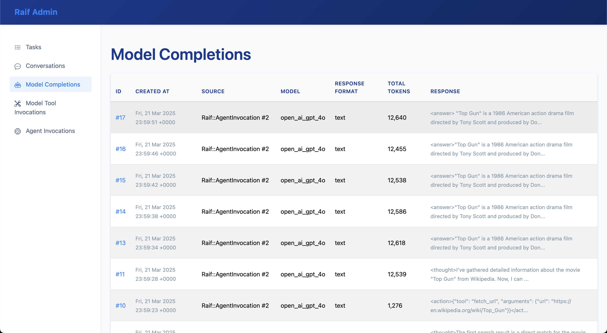{:class="img-border"}

`Raif::ModelCompletion` record detail:
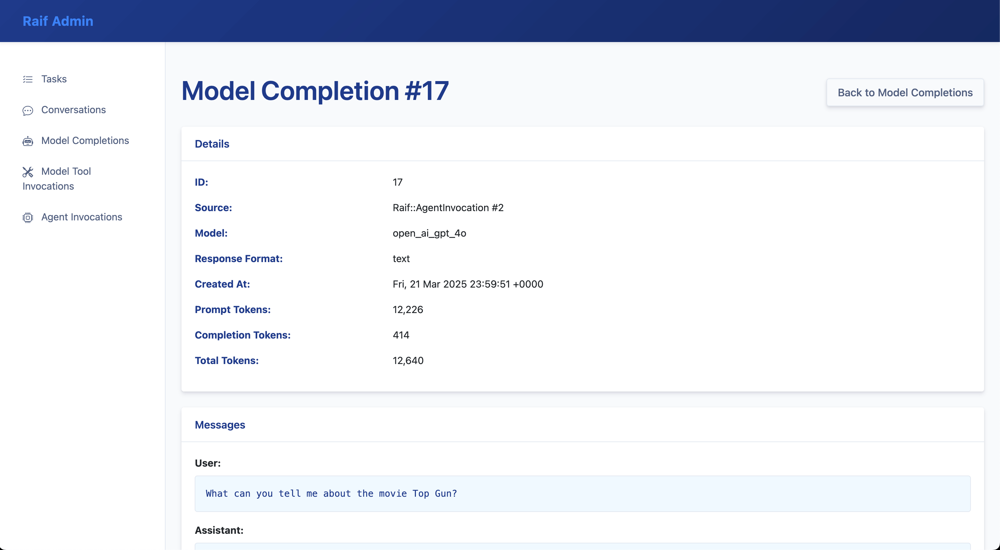{:class="img-border"}

## Tasks

List of `Raif::Task` records:
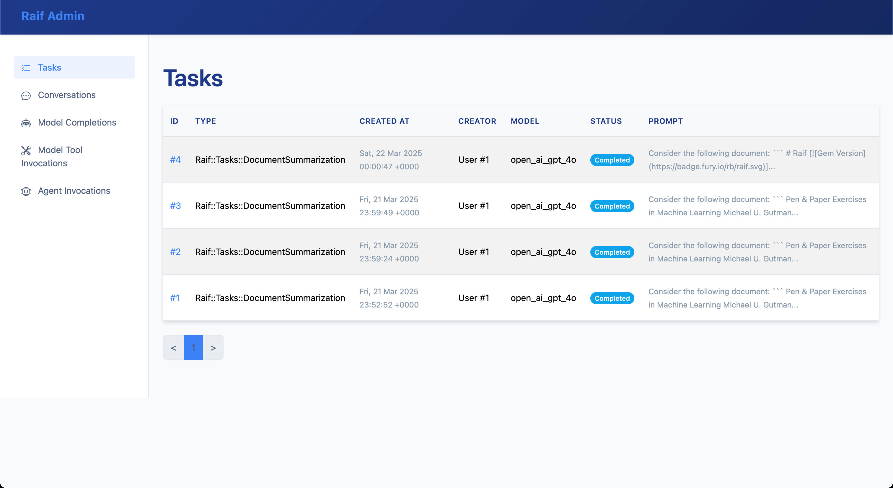{:class="img-border"}

`Raif::Task` record detail:
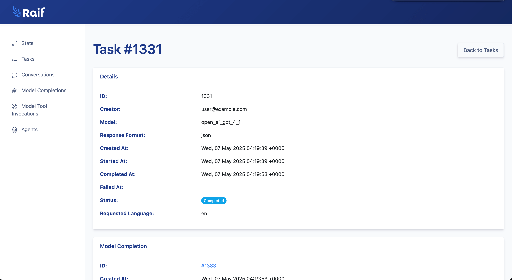{:class="img-border"}

## Conversations

List of `Raif::Conversation` records:
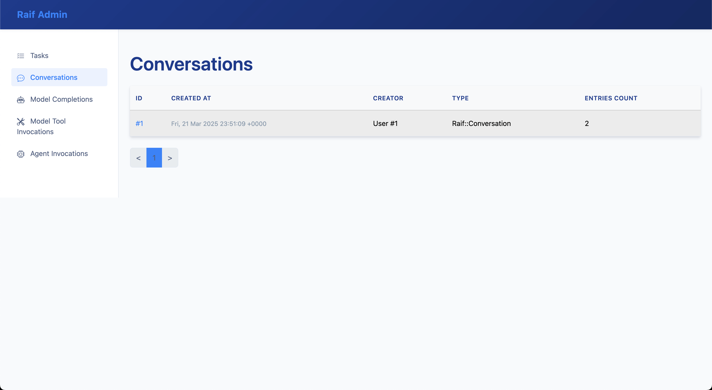{:class="img-border"}

`Raif::Conversation` record detail:
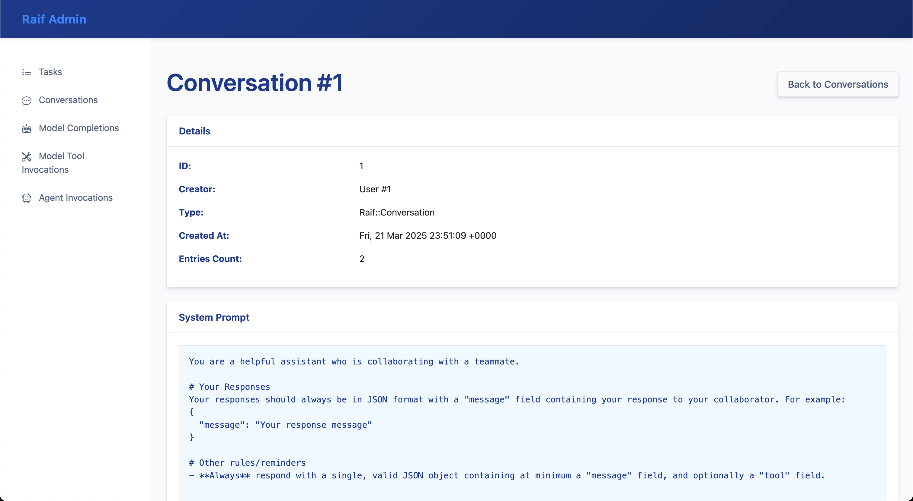{:class="img-border"}

## Agents

List of `Raif::Agent` records:
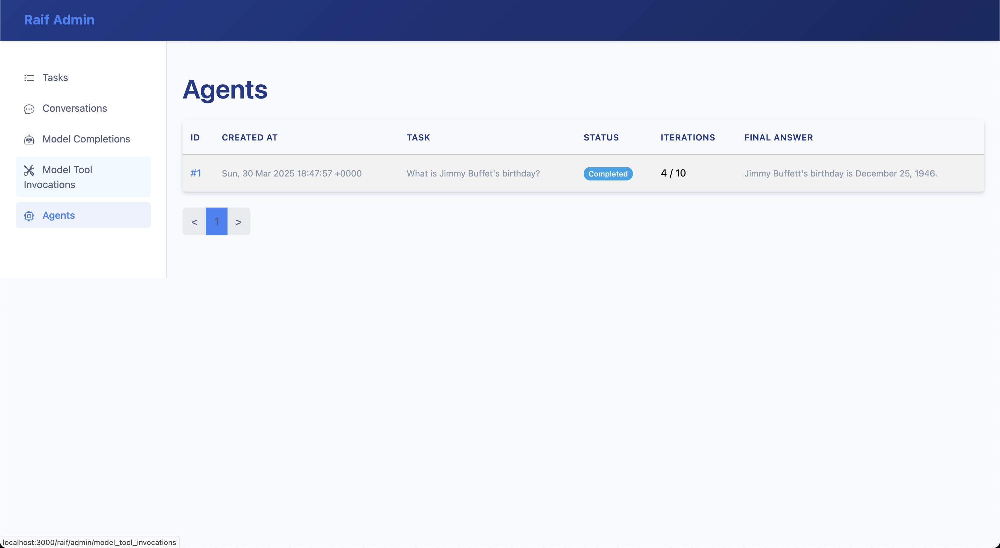{:class="img-border"}

`Raif::Agent` record detail:
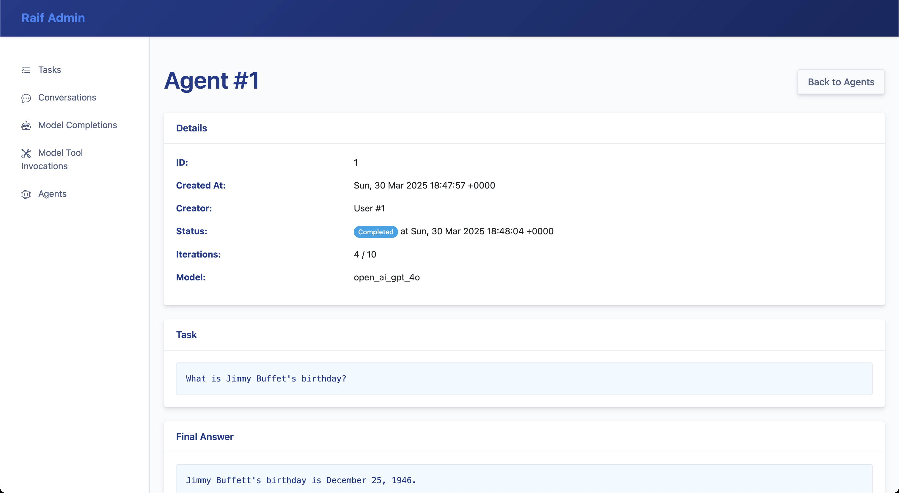{:class="img-border"}

## Model Tool Invocations

List of `Raif::ModelToolInvocation` records:
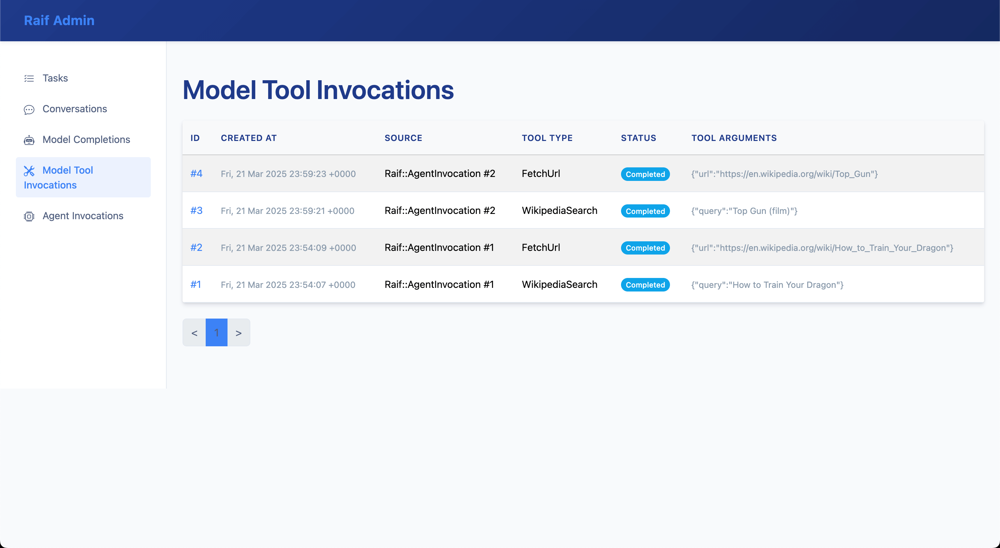{:class="img-border"}

`Raif::ModelToolInvocation` record detail:
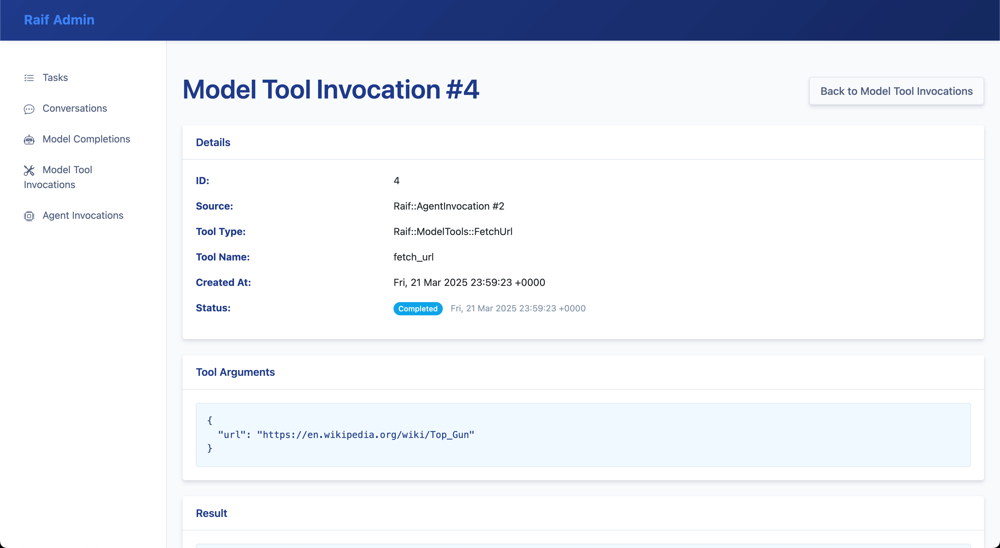{:class="img-border"}

## Stats

Stats & estimated cost tracking:
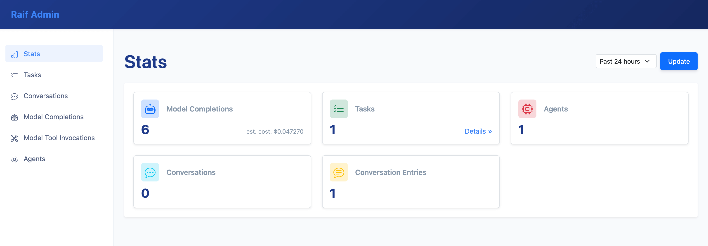{:class="img-border"}

Aggregated task stats & estimated cost tracking:
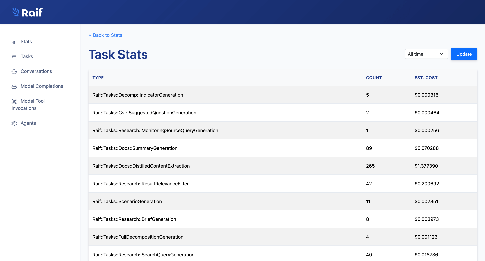{:class="img-border"}

---

**Read next:** [Response Formats](response_formats)