

# Web Admin Overview

Raif includes a web admin interface for viewing all interactions with the LLM. Assuming you have the engine mounted at `/raif`, you can access the admin interface at `/raif/admin`.

The admin interface contains sections for:
- [Model Completions](#model-completions)
- [Tasks](#tasks)
- [Conversations](#conversations)
- [Agents](#agents)
- [Model Tool Invocations](#model-tool-invocations)
- [Prompt Studio](#prompt-studio)
- [LLM Registry](#llm-registry)
- [Stats](#stats)

# Authorization

To control authorization for the admin interface, you can configure the `authorize_admin_controller_action` option in your initializer:

```ruby
Raif.configure do |config|
  config.authorize_admin_controller_action = ->{ current_user&.admin? }
end
```

# Screenshots
## Model Completions

List of `Raif::ModelCompletion` records:
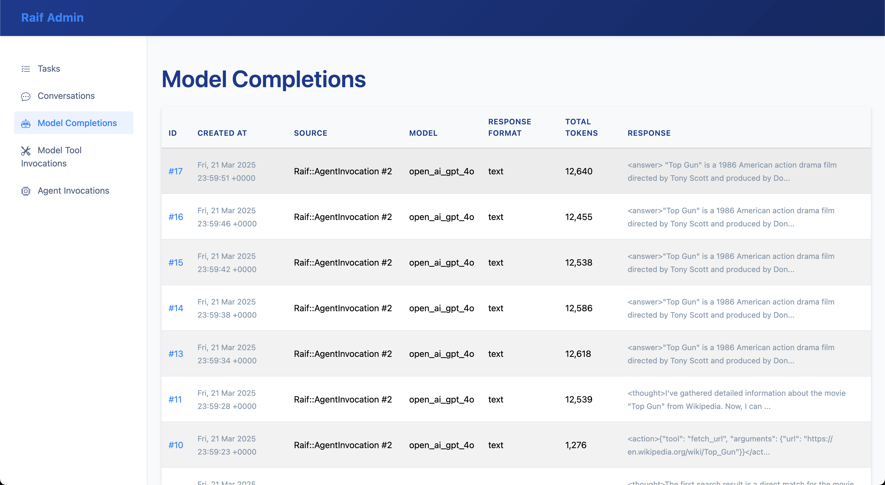{:class="img-border"}

`Raif::ModelCompletion` record detail:
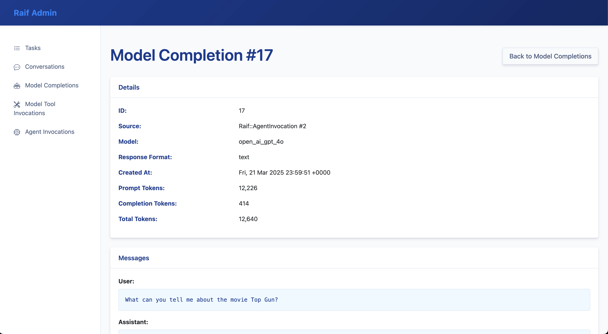{:class="img-border"}

## Tasks

List of `Raif::Task` records:
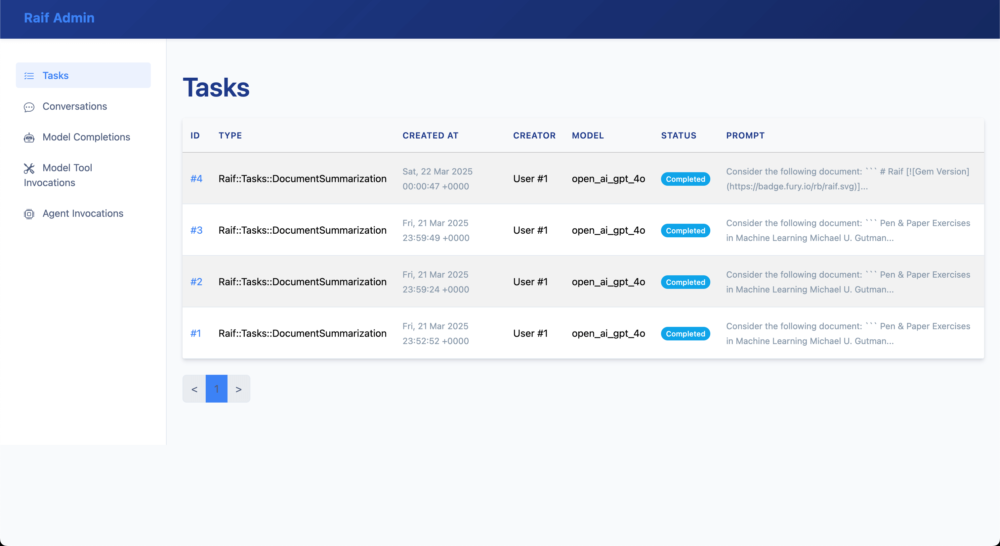{:class="img-border"}

`Raif::Task` record detail:
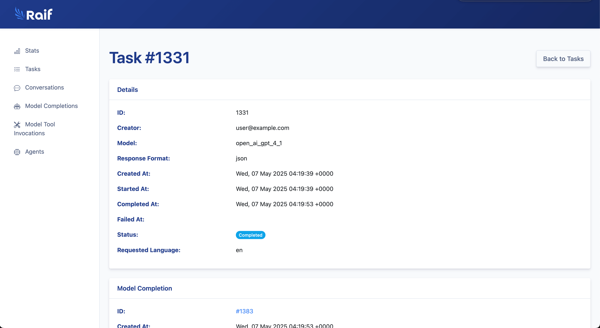{:class="img-border"}

## Conversations

List of `Raif::Conversation` records:
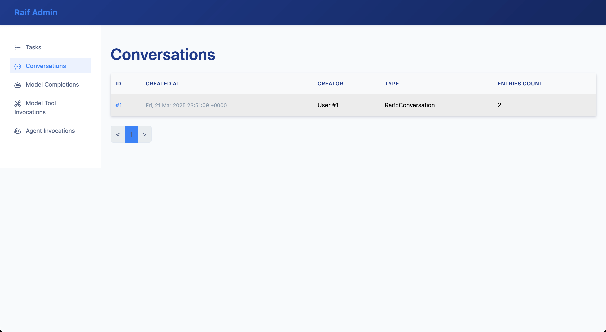{:class="img-border"}

`Raif::Conversation` record detail:
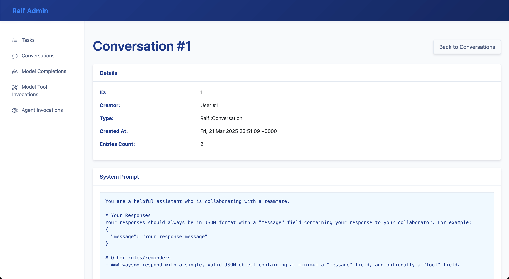{:class="img-border"}

## Agents

List of `Raif::Agent` records:
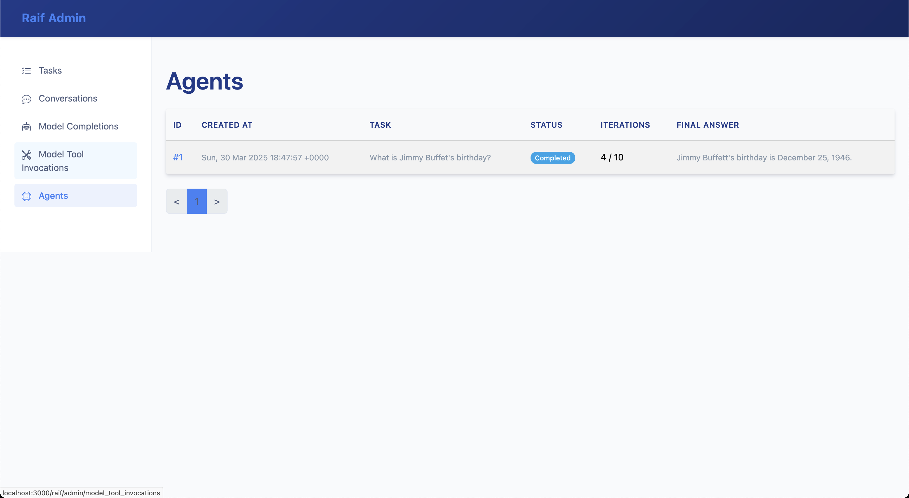{:class="img-border"}

`Raif::Agent` record detail:
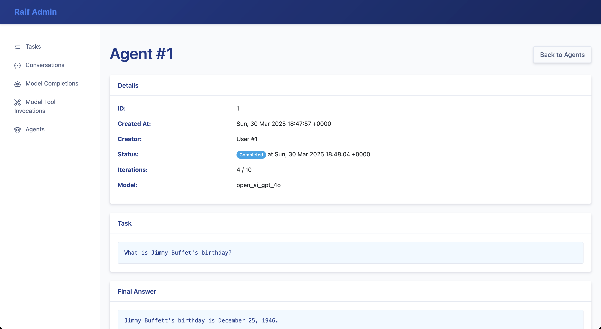{:class="img-border"}

## Model Tool Invocations

List of `Raif::ModelToolInvocation` records:
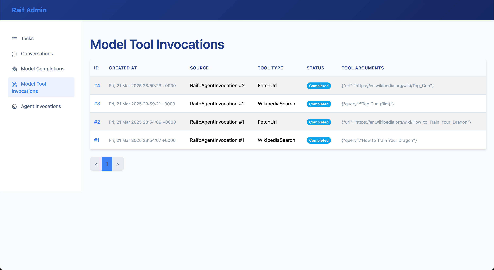{:class="img-border"}

`Raif::ModelToolInvocation` record detail:
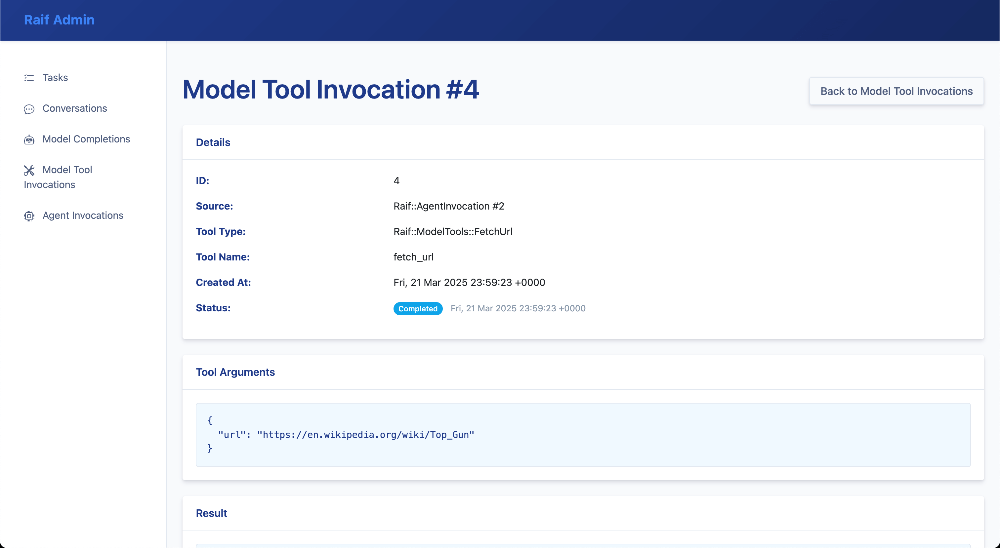{:class="img-border"}

## Prompt Studio

Prompt Studio lets you inspect and compare [prompt templates](prompt_templates) using real database records. Select a task, conversation, or agent type, browse existing instances, and see a side-by-side comparison of the current prompt versus the prompt that was originally stored when the record was created. This makes it easy to see how template changes affect real-world inputs.

Prompt Studio is available at:
- `/raif/admin/prompt_studio/tasks`
- `/raif/admin/prompt_studio/conversations`
- `/raif/admin/prompt_studio/agents`

### Batch Runs

From Prompt Studio you can create a **batch run** that re-executes a task against a set of existing records with the current prompt and a chosen LLM, so you can see how prompt or model changes perform across many inputs. Each batch run stores its items and outputs for later inspection.

Optionally, a batch run can be scored by an **LLM judge**. Raif ships with four judge types:

- `Raif::Evals::LlmJudges::Binary` – pass/fail judgments against a criterion
- `Raif::Evals::LlmJudges::Scored` – numeric scoring against a rubric
- `Raif::Evals::LlmJudges::Comparative` – compares outputs against a reference
- `Raif::Evals::LlmJudges::Summarization` – scores summaries with a built-in rubric

See [Evals](../key_raif_concepts/evals) for more on LLM judges.

## LLM Registry

The LLM registry page at `/raif/admin/llms` lists every model registered in the running process, along with its provider, API name, and input/output token costs. Use it to verify which models are registered and to compare provider pricing when picking a default. See [Adding LLM Models](customization#adding-llm-models) to register new models.

## Stats

Stats & estimated cost tracking:
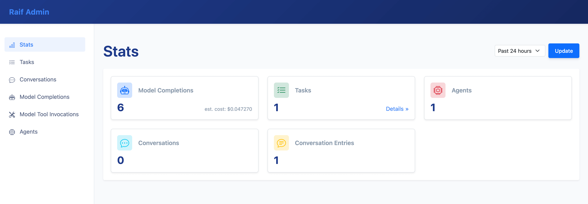{:class="img-border"}

Aggregated task stats & estimated cost tracking:
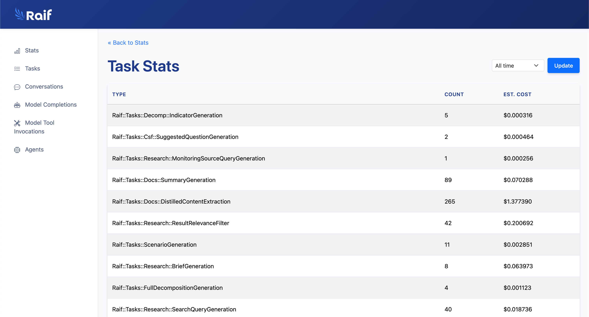{:class="img-border"}

---

**Read next:** [Response Formats](response_formats)